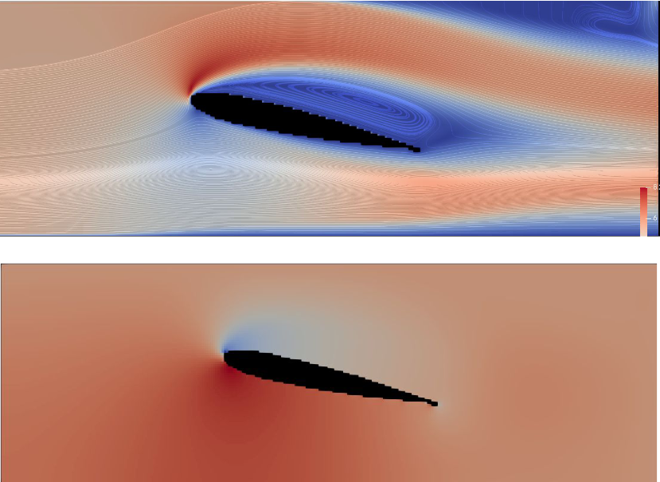

**介绍**

该项目架构较为简单，为自己空闲时捣鼓东西所用，可以方便初学者学习cfd的基本算法与框架等内容。

**编译**

该库依赖于vtk作为软件的输入输出，windows平台下为vtk8.20,自己只需要更改一下cmake中vtk的路径即可编译。

\# VTK Library

set(VTK_DIR "D:/VTK-8.2.0/out/install/lib/cmake/vtk-8.2")

if(WIN32)

  find_package(VTK REQUIRED)

else()

  find_package(VTK 8.20 REQUIRED)

endif()

sst 无粘

ke

